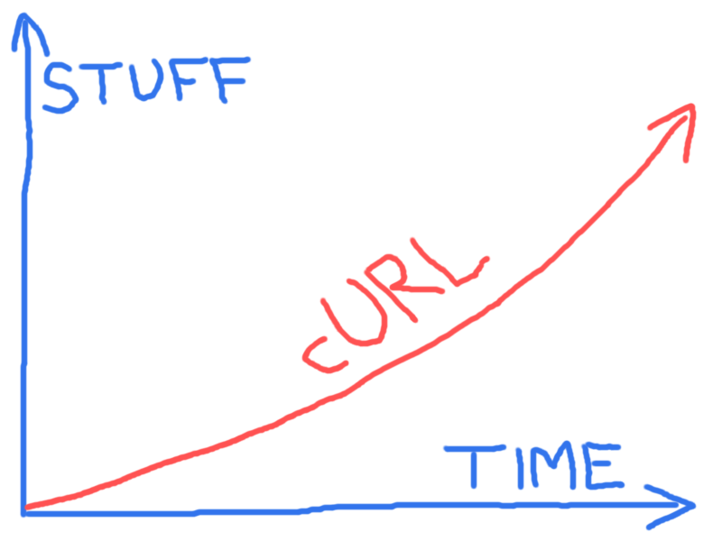

## Future

There's no slowdown in sight in curl's future, bugs reported, development
pace or how Internet protocols are being developed or updated.

We're looking forward to support for more protocols, support for more features
within the already supported protocols, and more and better APIs for libcurl to
allow users to do transfers even better and faster.

The project casually maintains a [TODO](https://curl.haxx.se/docs/todo.html)
file holding a bunch of ideas that we could work on in the future. It also
keeps a [KNOWN_BUGS](https://curl.haxx.se/docs/knownbugs.html) document with,
yes, a list of known problems we would like to get fixed.

There's a [ROADMAP](https://curl.haxx.se/dev/roadmap.html) document that
describe some plans for the short-term that some of the active developers
thought they'd work on next. No promises or guarantees are implied, of course.

We are highly dependent on developers to join in and work on what they want to
get done, be it bug fixes or new features.
