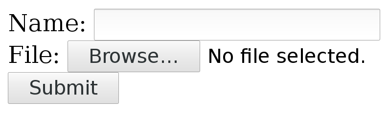

## HTTP multipart formposts

A multipart formpost is what an HTTP client sends when an HTML form is
submitted with *enctype* set to "multipart/form-data". It is an HTTP POST
request sent with the request body specially formatted as a series of "parts",
separated with MIME boundaries.

An example piece of HTML would look like this:

~~~
    <form action="submit.cgi" method="post" enctype="multipart/form-data">
       Name: <input type="text" name="person"> 
       File: <input type="file" name="secret"> 
       <input type="submit" value="Submit">
    </form> 
~~~
Which could look something like this in a web browser:

A user can fill in text in the 'Name' field and by pressing the 'Browse'
button a local file can be selected that will be uploaded when 'Submit' is
pressed.

### Sending such a form with curl

With curl, you add each separate multipart with one `-F` (or `--form`) flag
and you then continue and add one -F for every input field in the form that
you want to send.

The above small example form has two parts, one named 'person' that is a plain
text field and one named 'secret' that is a file.

Send your data to that form like this:

    curl -F person=anonymous -F secret=@file.txt http://example.com/submit.cgi

### The HTTP this generates

The **action** specifies where the POST is sent. **method** says it is a POST
and **enctype** tells us it is a multipart formpost.

With the fields filled in as shown above, curl generates and sends these HTTP
request headers to the host example.com:

    POST /submit.cgi HTTP/1.1
    Host: example.com
    User-Agent: curl/7.46.0
    Accept: */*
    Content-Length: 313
    Expect: 100-continue
    Content-Type: multipart/form-data; boundary=------------------------d74496d66958873e

**Content-Length**, of course, tells the server how much data to expect. This
example's 313 bytes is really small.

The **Expect** header is explained in the [HTTP POST](http-post.md) chapter.

The **Content-Type** header is a bit special. It tells that this is a
multipart formpost and then it sets the "boundary" string. The boundary string
is a line of characters with a bunch of random digits somewhere in it, that
serves as a separator between the different parts of the form that will be
submitted. The particular boundary you see in this example has the random part
`d74496d66958873e` but you will, of course, get something different when you run
curl (or when you submit such a form with a browser).

So after that initial set of headers follows the request body

    --------------------------d74496d66958873e
    Content-Disposition: form-data; name="person"

    anonymous
    --------------------------d74496d66958873e
    Content-Disposition: form-data; name="secret"; filename="file.txt"
    Content-Type: text/plain

    contents of the file
    --------------------------d74496d66958873e--

Here you clearly see the two parts sent, separated with the boundary
strings. Each part starts with one or more headers describing the individual
part with its name and possibly some more details. Then after the part's
headers come the actual data of the part, without any sort of encoding.

The last boundary string has two extra dashes `--` appended to signal the end.

### Content-Type

POSTing with curl's -F option will make it include a default Content-Type
header in its request, as shown in the above example. This says
`multipart/form-data` and then specifies the MIME boundary string. That
content-type is the default for multipart formposts but you can, of course,
still modify that for your own commands and if you do, curl is clever enough
to still append the boundary magic to the replaced header. You cannot really
alter the boundary string, since curl needs that for producing the POST
stream.

To replace the header, use `-H` like this:

    curl -F 'name=Dan' -H 'Content-Type: multipart/magic' https://example.com

### Converting an HTML form

TBD
