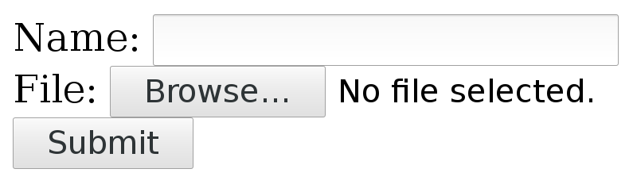

# Multipart formposts

A multipart formpost is what an HTTP client sends when an HTML form is
submitted with *enctype* set to `multipart/form-data`. It is an HTTP POST
request sent with the request body specially formatted as a series of parts,
separated with MIME boundaries.

An example piece of HTML would look like this:

    <form action="submit.cgi" method="post" enctype="multipart/form-data">
      Name: <input type="text" name="person"> 
      File: <input type="file" name="secret"> 
      <input type="submit" value="Submit">
    </form>

Which could look something like this in a web browser:

A user can fill in text in the 'Name' field and by pressing the `Browse`
button a local file can be selected that is uploaded when `Submit` is pressed.

## Sending such a form with curl

With curl, you add each separate multipart with one `-F` (or `--form`) flag
and you then continue and add one -F for every input field in the form that
you want to send.

The above small example form has two parts, one named 'person' that is a plain
text field and one named 'secret' that is a file.

Send your data to that form like this:

    curl -F person=anonymous -F secret=@file.txt http://example.com/submit.cgi

## The HTTP this generates

The **action** specifies where the POST is sent. **method** says it is a POST
and **enctype** tells us it is a multipart formpost.

With the fields filled in as shown above, curl generates and sends these HTTP
request headers to the host example.com:

    POST /submit.cgi HTTP/1.1
    Host: example.com
    User-Agent: curl/7.46.0
    Accept: */*
    Content-Length: 313
    Expect: 100-continue
    Content-Type: multipart/form-data; boundary=------------d74496d66958873e

**Content-Length**, of course, tells the server how much data to expect. This
example's 313 bytes is really small.

The **Expect** header is explained in the [Expect 100 continue](expect100.md)
chapter.

The **Content-Type** header is a bit special. It tells that this is a
multipart formpost and then it sets the boundary string. The boundary string
is a line of characters with a bunch of random digits somewhere in it, that
serves as a separator between the different parts of the form that is
submitted. The particular boundary you see in this example has the random part
`d74496d66958873e` but you, of course, get something different when you run
curl (or when you submit such a form with a browser).

So after that initial set of headers follows the request body

    --------------------------d74496d66958873e
    Content-Disposition: form-data; name="person"

    anonymous
    --------------------------d74496d66958873e
    Content-Disposition: form-data; name="secret"; filename="file.txt"
    Content-Type: text/plain

    contents of the file
    --------------------------d74496d66958873e--

Here you clearly see the two parts sent, separated with the boundary
strings. Each part starts with one or more headers describing the individual
part with its name and possibly some more details. Then after the part's
headers come the actual data of the part, without any sort of encoding.

The last boundary string has two extra dashes `--` appended to signal the end.

## Content-Type

POSTing with curl's `-F` option makes it include a default `Content-Type`
header in its request, as shown in the above example. This says
`multipart/form-data` and then specifies the MIME boundary string. That
`Content-Type` is the default for multipart formposts but you can, of course,
still modify that for your own commands and if you do, curl is clever enough
to still append the boundary magic to the replaced header. You cannot really
alter the boundary string, since curl needs that for producing the POST
stream.

To replace the header, use `-H` like this:

    curl -F 'name=Dan' -H 'Content-Type: multipart/magic' https://example.com

## Converting a web form

There are a few different ways to figure out how to write a curl command line
to submit a multipart form as seen in HTML.

1. Save the HTML locally, run `nc` locally to listen on a chosen port number,
   change the `action` URL to submit the POST to your local `nc`
   instance. Submit the form and watch how `nc` shows it. Then translate into
   a curl command line.

2. Use the development tools in your favorite browser and inspect the POST
   request in the network tab after you have submitted it. Then convert that
   HTTP data to a curl command line. Unfortunately, the
   [copy as curl](../../cmdline/copyas.md) feature in the browsers usually do
   not actually do multipart formposts particularly well.

3. Inspect the source HTML and convert into a curl command line directly from
   that.

## From `<form>` to -F

In a `<form>` that uses `enctype="multipart/form-data"`, the first step is to
find the `action=` property as that tells the target for the POST. You need to
convert that into a full URL for your curl command line.

An example action looks like this:

    <form action="submit.cgi" method="post" enctype="multipart/form-data">

If the form is found in a webpage hosted on a URL like for example
`https://example.com/user/login` the `action=submit.cgi` is a relative path
within the same directory as the form itself. The full URL to submit this form
thus becomes `https://example.com/user/submit.cgi`. That is the URL to use in
the curl command line.

Next, you must identify every `<input>` tag used within the form, including
the ones that are marked as hidden. Hidden just means that they are not shown
in the webpage, but they should still be sent in the POST.

For every `<input>` in the form there should be a corresponding `-F` in the
command line.

### text input

A regular tag using type text in the style like

    <input type="text" name="person">

should then set the field name with content like this:

    curl -F "person=Mr Smith" https://example.com/

### file input

When the input type is set to a file, like in:

    <input type="file" name="image">

You provide a file for this part by specifying the filename and use `@` and
the path to the file to include:

    curl -F image=@funnycat.gif https://example.com/

### hidden input

A common technique to pass on state from a form is to set a number of
`<input>` tags as `type="hidden"`. This is basically the same thing as an
already filled in form field, so you convert this to a command line by using
the name and value. For example:

    <input type="hidden" name="username" value="bob123">

This is converted like for the normal text field, and here you know what the
content should be:

    curl -F "username=bob123" https://example.com/

### All fields at once

If we toy with the idea that all the three different `<input>` tags showed in
the examples above were used in the same `<form>`, then a complete curl
command line to send, including the correct URL as extracted above, would look
like:

    curl -F "person=Mr Smith" -F image=@funnycat.gif -F "username=bob123" \
      https://example.com/user/submit.cgi
