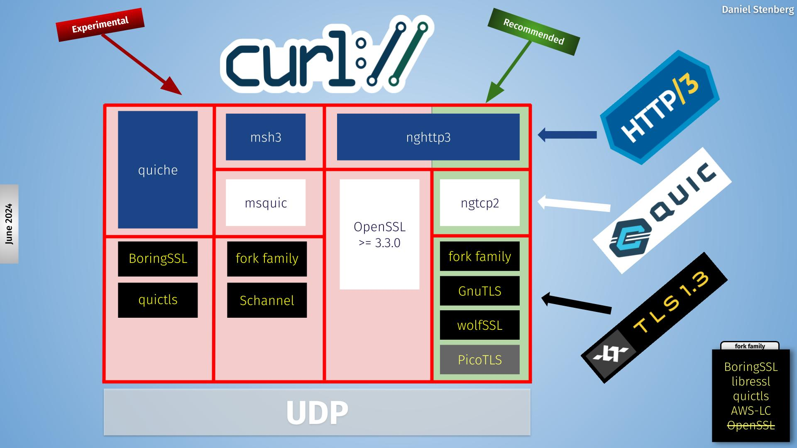

# Backends

A backend in curl is a **build-time selectable alternative implementation**.

When you build curl, you can select alternative implementations for several
different things. Different providers of the same feature set. You select
which backend or backends (plural) to use when you build curl.

- Backends are selectable and deselectable
- Often platform dependent
- Can differ in features
- Can differ in 3rd party licenses
- Can differ in maturity
- The internal APIs are never exposed externally

## Different backends

In the libcurl source code, there are internal APIs for providing
functionality. In these different areas there are multiple different providers:

1. IDN
2. Name resolving
3. TLS
4. SSH
5. HTTP/1
6. HTTP/3
7. HTTP content encoding

## Backends visualized

Applications (in the upper green cloud) access libcurl through the public API.
The API is fixed and stable.

Internally, the core of libcurl uses internal APIs to perform the different
duties it needs to do. Each of these internal APIs are powered by alternative
implementations, in many times powered by different third party libraries.

The image above shows the different third party libraries powering different
internal APIs. The purple boxes are one or more and the dark gray ones are
"one of these".

## HTTP/3 backends

libcurl offers four different backends, visualized as different column in this
picture.

The same data in a table, where each line is a specific backend build:

| status       | HTTP/3 library | QUIC library   | TLS libraries (one of)          |
|--------------|----------------|----------------|---------------------------------|
| recommended  | nghttp3        | ngtcp2         | fork family, GnutTLS or wolfSSL |
| experimental | quiche         | quiche         | BoringSSL or quictls            |
| experimental | msh3           | msquic         | fork family or Schannel         |
| experimental | nghttp3        | OpenSSL 3.3.0+ | OpenSSL 3.3.0+                  |

*fork family* means BoringSSL, LibreSSL, quictls and AWS-LC
