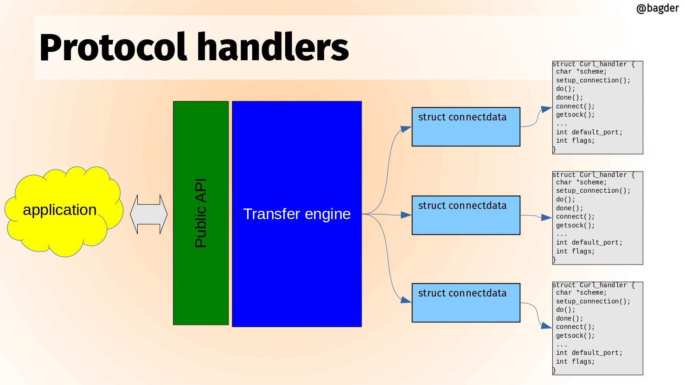

# Protocol handler

libcurl is a multi-protocol transfer library. The core of the code is a set of
generic functions that are used for transfers in general and mostly works the
same for all protocols. The main state machine described above for example is
there and works for all protocols - even though some protocols may not make
use of all states for all transfers.

However, each different protocol libcurl speaks also has its unique
particularities and specialties. In order to not have the code littered with
conditions in the style if the protocol is XYZ, then do…, we instead have
the concept of `Curl_handler`. Each supported protocol defines one of those in
`lib/url.c` there is an array of pointers to such handlers called
`protocols[]`.

When a transfer is about to be done, libcurl parses the URL it is about to
operate on and among other things it figures out what protocol to use.
Normally this can be done by looking at the scheme part of the URL. For
`https://example.com` that is `https` and for `imaps://example.com` it is
`imaps`. Using the provided scheme, libcurl sets the `conn->handler` pointer
to the handler struct for the protocol that handles this URL.

The handler struct contains a set of function pointers that can be NULL or set
to point to a protocol specific function to do things necessary for that
protocol to work for a transfer. Things that not all other protocols need. The
handler struct also sets up the name of the protocol and describes its feature
set with a bitmask.

A libcurl transfer is built around a set of different actions and the handler
can extend each of them. Here are some example function pointers in this
struct and how they are used:

## Setup connection

If a connection cannot be reused for a transfer, it needs to setup a connection
to the host given in the URL and when it does, it can also call the protocol
handler's function for it. Like this:

    if(conn->handler->setup_connection)
      result = conn->handler->setup_connection(data, conn);

## Connect

After a connection has been established, this function gets called

    if(conn->handler->connect_it)
      result = conn->handler->connect_it(data, &done);

## Do

*Do* is simply the action that issues a request for the particular resource
the URL identifies. All protocol has a do action so this function must be
provided:

    result = conn->handler->do_it(data, &done);

## Done

When a transfer is completed, the *done* action is taken:

    result = conn->handler->done(data, status, premature);

## Disconnect

The connection is about to be taken down.

    result = conn->handler->disconnect(data, conn, dead_connection);
