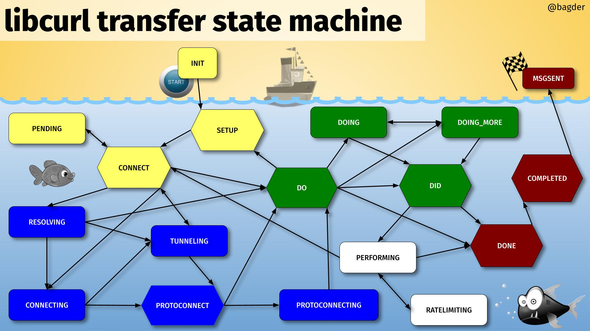

# State machines

To facilitate non-blocking behavior all through, the curl source is full of
state machines. Work on as much data as there is and drive the state machine
to where it can go based on what's available and allow the functions to
continue from that point later on when more data arrives that then might drive
the state machine further.

There are such states in many different levels for a given transfer and the
code for each particular protocol may have its own set of state machines.

## mstate

One of the primary states is the main transfer "mode" the easy handle holds,
which says if the current transfer is resolving, waiting for a resolve,
connecting, waiting for a connect, issuing a request, doing a transfer etc
(see the `CURLMstate` enum in `lib/multihandle.h`). Every transfer done with
libcurl has an associated easy handle and every easy handle exercises that
state machine.

The image below shows all states and possible state transitions. See further
explanation below.

All transfers start in **INIT** and they end in **MSGSENT**

**yellow**: the initial setting-up states

**blue**: resolving names and setting up the connection

**green**: initiating and setting up the transfer

**white**: the transfer

**red**: post-transfer

All states within the striped area have an associated connection.
