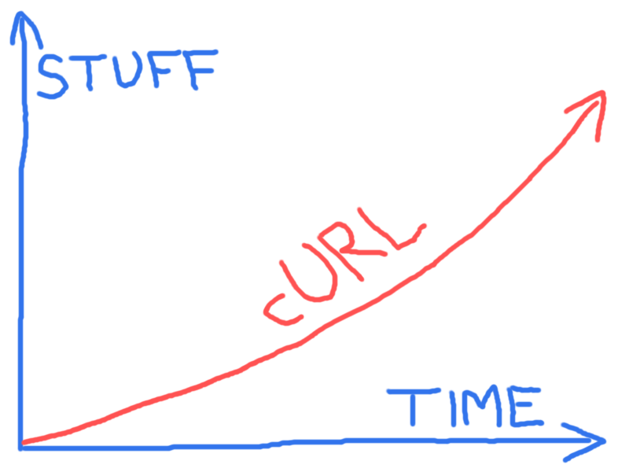

# Future

There is no slowdown in sight in curl's future, bugs reported, development pace or how Internet protocols are being developed or updated.

We are looking forward to support for more protocols, support for more features within the already supported protocols, and more and better APIs for libcurl to allow users to do transfers even better and faster.

The project casually maintains a [TODO](https://curl.se/docs/todo.html) file holding a bunch of ideas that we could work on in the future. It also keeps a [KNOWN\_BUGS](https://curl.se/docs/knownbugs.html) document with a list of known problems we would like to fix.

There is a [ROADMAP](https://curl.se/dev/roadmap.html) document that describes
some plans for the short-term that some of the active developers thought they
would work on next. Of course, we can not promise that we will always follow it.

We are highly dependent on developers to join in and work on what they want to get done, be it bug fixes or new features.
