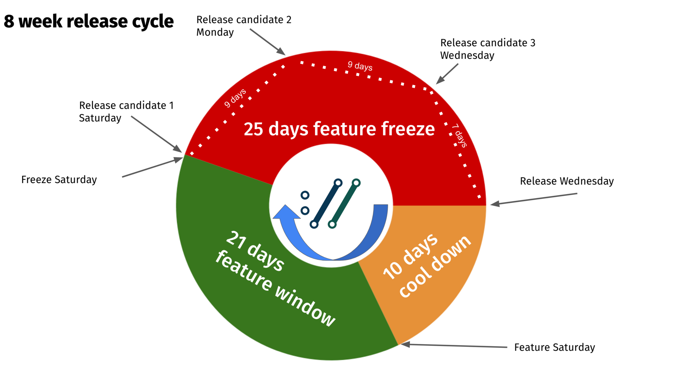

# Releases

A release in the curl project means packaging up all the source code that is
in the master branch of the code repository, signing the package, tagging the
point in the code repository, and then putting it up on the website for the
world to download.

It is one single source code archive for all platforms curl can run on. It is
the one and only package for both curl and libcurl.

We never ship any curl or libcurl _binaries_ from the project with one
exception: we host official curl binaries built for Windows users. All the
other packaged binaries that are provided with operating systems or on other
download sites are done by gracious volunteers outside of the project.

As of several years back, we make an effort to do our releases on an eight
week cycle and unless some really serious and urgent problem shows up we stick
to this schedule. We release on a Wednesday, and then again a Wednesday eight
weeks later and so it continues. Non-stop.

For every release we tag the source code in the repository with the curl
version number and we update the [changelog](https://curl.se/changes.html).

We had done a total of 253 releases by January 2024. The entire release
history and changelog is available in our [curl release
log](https://curl.se/docs/releases.html).

## Release cycle

## Daily snapshots

Every single change to the source code is committed and pushed to the source
code repository. This repository is hosted on github.com and is using git
these days (but has not always been this way). When building curl off the
repository, there are a few things you need to generate and set up that
sometimes cause people some problems or just friction. To help with that, we
provide daily snapshots.

The daily snapshots are generated daily (clever naming, right?) as if a
release had been made at that point. It produces a package of all source code
and all files that are normally part of a release and puts it in a package and
uploads it to [this special place](https://curl.se/snapshots/) to allow
interested people to get the latest code to test, to experiment or whatever.

The snapshots are kept for around 20 days until deleted.
