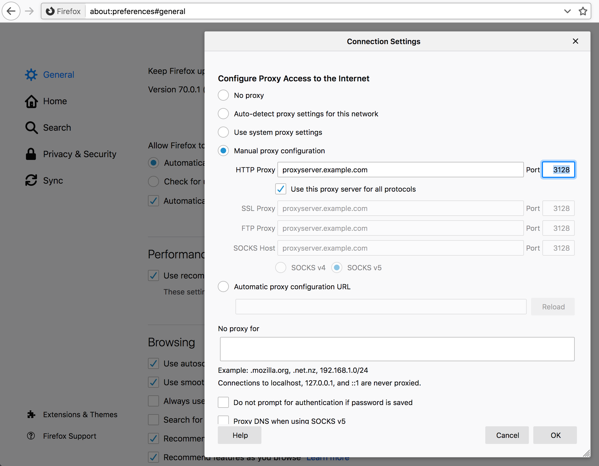

# Proxies

A proxy is a machine or software that does something on behalf of you, the
client.

You can also see it as a middle man that sits between you and the server you
want to work with, a middle man that you connect to instead of the actual
remote server. You ask the proxy to perform your desired operation for you and
then it will run off and do that and then return the data to you.

There are several different types of proxies and we shall list and discuss
them further down in this section.

## Discover your proxy

Some networks are setup to require a proxy in order for you to reach the
Internet or perhaps that special network you are interested in. The use of
proxies are introduced on your network by the people and management that run
your network for policy or technical reasons.

In the networking space there are a few methods for the automatic detection of
proxies and how to connect to them, but none of those methods are truly
universal and curl supports none of them. Furthermore, when you communicate to
the outside world through a proxy that often means that you have to put a lot of
trust on the proxy as it will be able to see and modify all the non-secure
network traffic you send or get through it. That trust is not easy to assume
automatically.

If you check your browser's network settings, sometimes under an advanced
settings tab, you can learn what proxy or proxies your browser is configured
to use. Chances are big that you should use the same one or ones when you use
curl.

As an example, you can find [proxy settings for Firefox browser](https://support.mozilla.org/en-US/kb/connection-settings-firefox) in Preferences => General => Network Settings as shown below:

## PAC

Some network environments provides several different proxies that should be
used in different situations, and a customizable way to handle that is
supported by the browsers. This is called "[proxy auto-config](https://en.wikipedia.org/wiki/Proxy_auto-config)", or PAC.

A PAC file contains a JavaScript function that decides which proxy a given
network connection (URL) should use, and even if it should not use a proxy at
all. Browsers most typically read the PAC file off a URL on the local network.

Since curl has no JavaScript capabilities, curl does not support PAC files. If
your browser and network use PAC files, the easiest route forward is usually
to read the PAC file manually and figure out the proxy you need to specify to
run curl successfully.

## Captive portals

These are not proxies but they're blocking the way between you and the server
you want to access.

A "captive portal" is one of these systems that are popular to use in hotels,
airports and for other sorts of network access to a larger audience. The
portal will "capture" all network traffic and redirect you to a login web page
until you have either clicked OK and verified that you have read their
conditions or perhaps even made sure that you have paid plenty of money for
the right to use the network.

curl's traffic will of course also captured by such portals and often the best
way is to use a browser to accept the conditions and "get rid of" the portal
since from then on they often allow all other traffic originating from that
same machine (MAC address) for a period of time.

Most often you can use curl too to submit that "ok" affirmation, if you just
figure out how to submit the form and what fields to include in it. If this is
something you end up doing many times, it may be worth exploring.

## Proxy type

curl supports several different types of proxies.

The default proxy type is HTTP so if you specify a proxy host name (or IP
address) without a scheme part (the part that is often written as "http://")
curl goes with assuming it's an HTTP proxy.

curl also allows a number of different options to set the proxy type instead of
using the scheme prefix. See the [SOCKS](#socks) section below.

## HTTP

An HTTP proxy is a proxy that the client speaks HTTP with to get the transfer
done. curl will, by default, assume that a host you point out with `-x` or
`--proxy` is an HTTP proxy, and unless you also specify a port number it will
default to port 1080 (and the reason for that particular port number is purely
historical).

If you want to request the example.com web page using a proxy on 192.168.0.1
port 8080, a command line could look like:

    curl -x 192.168.0.1:8080 http://example.com/

Recall that the proxy receives your request, forwards it to the real
server, then reads the response from the server and then hands that back to the
client.

If you enable verbose mode with `-v` when talking to a proxy, you will see
that curl connects to the proxy instead of the remote server, and you will see
that it uses a slightly different request line.

## HTTPS with HTTP proxy

HTTPS was designed to allow and provide secure and safe end-to-end privacy
from the client to the server (and back). In order to provide that when
speaking to an HTTP proxy, the HTTP protocol has a special request that curl
uses to setup a tunnel through the proxy that it then can encrypt and
verify. This HTTP method is known as `CONNECT`.

When the proxy tunnels encrypted data through to the remote server after a
CONNECT method sets it up, the proxy cannot see nor modify the traffic without
breaking the encryption:

    curl -x proxy.example.com:80 https://example.com/

## MITM-proxies

MITM means Man-In-The-Middle. MITM-proxies are usually deployed by companies
in "enterprise environments" and elsewhere, where the owners of the network
have a desire to investigate even TLS encrypted traffic.

To do this, they require users to install a custom "trust root" (Certificate Authority (CA) certificate) in
the client, and then the proxy terminates all TLS traffic from the client,
impersonates the remote server and acts like a proxy. The proxy then
sends back a generated certificate signed by the custom CA. Such proxy setups
usually transparently capture all traffic from clients to TCP port 443
on a remote machine. Running curl in such a network would also get its HTTPS
traffic captured.

This practice, of course, allows the middle man to decrypt and snoop on
all TLS traffic.

## Non-HTTP protocols over an HTTP proxy

An "HTTP proxy" means the proxy itself speaks HTTP. HTTP proxies are primarily
used to proxy HTTP but it is also fairly common that they support
other protocols as well. In particular, FTP is fairly commonly supported.

When talking FTP "over" an HTTP proxy, it is usually done by more or less
pretending the other protocol works like HTTP and asking the proxy to "get
this URL" even if the URL is not using HTTP. This distinction is important
because it means that when sent over an HTTP proxy like this, curl does not
really speak FTP even though given an FTP URL; thus FTP-specific features will
not work:

    curl -x http://proxy.example.com:80 ftp://ftp.example.com/file.txt

What you can do instead then, is to "tunnel through" the HTTP proxy!

## HTTP proxy tunneling

Most HTTP proxies allow clients to "tunnel through" it to a server on the other
side. That's exactly what's done every time you use HTTPS through the HTTP
proxy.

You tunnel through an HTTP proxy with curl using `-p` or `--proxytunnel`.

When you do HTTPS through a proxy you normally connect through to the default HTTPS
remote TCP port number 443, so therefore you will find that most HTTP proxies
white list and allow connections only to hosts on that port number and perhaps
a few others. Most proxies will deny clients from connecting to just any
random port (for reasons only the proxy administrators know).

Still, assuming that the HTTP proxy allows it, you can ask it to tunnel
through to a remote server on any port number so you can do other protocols
"normally" even when tunneling. You can do FTP tunneling like this:

    curl -p -x http://proxy.example.com:80 ftp://ftp.example.com/file.txt

You can tell curl to use HTTP/1.0 in its CONNECT request issued to the HTTP
proxy by using `--proxy1.0 [proxy]` instead of `-x`.

## SOCKS types

SOCKS is a protocol used for proxies and curl supports it. curl supports both
SOCKS version 4 as well as version 5, and both versions come in two flavors.

You can select the specific SOCKS version to use by using the correct scheme
part for the given proxy host with `-x`, or you can specify it with a separate
option instead of `-x`.

SOCKS4 is for the version 4 and SOCKS4a is for the version 4 without resolving
the host name locally:

    curl -x socks4://proxy.example.com http://www.example.com/

    curl --socks4 proxy.example.com http://www.example.com/

The SOCKS4a versions:

    curl -x socks4a://proxy.example.com http://www.example.com/

    curl --socks4a proxy.example.com http://www.example.com/

SOCKS5 is for the version 5 and SOCKS5-hostname is for the version 5 without
resolving the host name locally:

    curl -x socks5://proxy.example.com http://www.example.com/

    curl --socks5 proxy.example.com http://www.example.com/

The SOCKS5-hostname versions. This sends the host name to the server so
there's no name resolving done locally:

    curl -x socks5h://proxy.example.com http://www.example.com/

    curl --socks5-hostname proxy.example.com http://www.example.com/

## Proxy authentication

HTTP proxies can require authentication, so curl then needs to provide
the proper credentials to the proxy to be allowed to use it, and failing to do
will only make the proxy return HTTP responses using code 407.

Authentication for proxies is similar to "normal" HTTP authentication. It is
separate from the server authentication to allow clients to independently use
both normal host authentication as well as proxy authentication.

With curl, you set the user name and password for the proxy authentication
with the `-U user:password` or `--proxy-user user:password` option:

    curl -U daniel:secr3t -x myproxy:80 http://example.com

This example will default to using the Basic authentication scheme. Some
proxies will require another authentication scheme (and the headers that are
returned when you get a 407 response will tell you which) and then you can ask
for a specific method with `--proxy-digest`, `--proxy-negotiate`,
`--proxy-ntlm`. The above example command again, but asking for NTLM auth with
the proxy:

    curl -U daniel:secr3t -x myproxy:80 http://example.com --proxy-ntlm

There's also the option that asks curl to figure out which method the proxy
wants and supports and then go with that (with the possible expense of extra
roundtrips) using `--proxy-anyauth`. Asking curl to use any method the proxy
wants is then like this:

    curl -U daniel:secr3t -x myproxy:80 http://example.com --proxy-anyauth

## HTTPS to proxy

All the previously mentioned protocols to speak with the proxy are clear text
protocols, HTTP and the SOCKS versions. Using these methods could allow
someone to eavesdrop on your traffic the local network where you or the proxy
reside.

One solution for that is to use HTTPS to the proxy, which then establishes a
secure and encrypted connection that is safe from easy surveillance.

When a HTTPS proxy is specified, the default port will be 443.

## Proxy environment variables

curl checks for the existence of specially named environment variables before
it runs to see if a proxy is requested to get used.

You specify the proxy by setting a variable named `[scheme]_proxy` to hold the
proxy host name (the same way you would specify the host with `-x`). So if you
want to tell curl to use a proxy when access a HTTP server, you set the
'http_proxy' environment variable. Like this:

    http_proxy=http://proxy.example.com:80
    curl -v www.example.com

While the above example shows HTTP, you can, of course, also set ftp_proxy,
https_proxy, and so on. All these proxy environment variable names except
http_proxy can also be specified in uppercase, like HTTPS_PROXY.

To set a single variable that controls *all* protocols, the ALL_PROXY exists.
If a specific protocol variable one exists, such a one will take precedence.

When using environment variables to set a proxy, you could easily end up in a
situation where one or a few host names should be excluded from going through
the proxy. This is then done with the NO_PROXY variable. Set that to a comma-
separated list of host names that should not use a proxy when being
accessed. You can set NO_PROXY to be a single asterisk ('\*') to match all
hosts.

As an alternative to the NO_PROXY variable, there's also a `--noproxy` command
line option that serves the same purpose and works the same way.

## http_proxy in lower case only

The HTTP version of the proxy environment variables is treated differently
than the others. It is only accepted in its lower case version because of the
CGI protocol, which lets users run scripts in a server when invoked by an HTTP
server. When a CGI script is invoked by a server, it automatically creates
environment variables for the script based on the incoming headers in the
request. Those environment variables are prefixed with uppercase `HTTP_`!

An incoming request to a HTTP server using a request header like `Proxy: yada`
will therefore create the environment variable `HTTP_PROXY` set to contain
`yada` before the CGI script is started. If that CGI script runs curl...

Accepting the upper case version of this environment variable has been the
source for many security problems in lots of software through times.

## Proxy headers

When you want to add HTTP headers meant specifically for a proxy and not for
the remote server, the `--header` option falls short.

For example, if you issue a HTTPS request through a HTTP proxy, it will be
done by first issuing a `CONNECT` to the proxy that establishes a tunnel to
the remote server and then it sends the request to that server. That first
`CONNECT` is only issued to the proxy and you may want to make sure only that
receives your special header, and send another set of custom headers to the
remote server.

Set a specific different `User-Agent:` only to the proxy:

    curl --proxy-header "User-Agent: magic/3000" -x proxy https://example.com/
