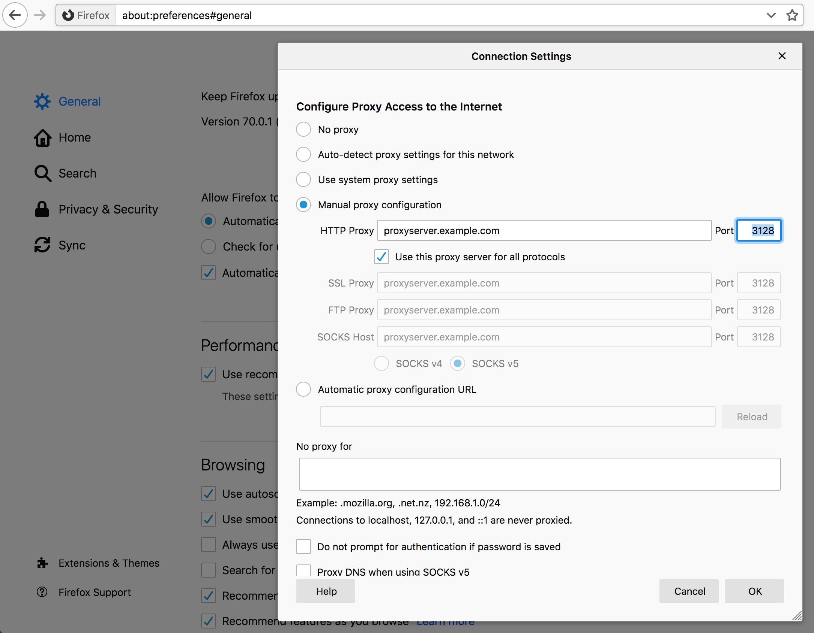

# Discover your proxy

Some networks are setup to require a proxy in order for you to reach the
Internet or perhaps that special network you are interested in. The use of
proxies are introduced on your network by the people and management that run
your network for policy or technical reasons.

In the networking space there are a few methods for the automatic detection of
proxies and how to connect to them, but none of those methods are truly
universal and curl supports none of them. Furthermore, when you communicate to
the outside world through a proxy that often means that you have to put a lot
of trust on the proxy as it is able to see and modify all the non-secure
network traffic you send or get through it. That trust is not easy to assume
automatically.

If you check your browser's network settings, sometimes under an advanced
settings tab, you can learn what proxy or proxies your browser is configured
to use. Chances are big that you should use the same one or ones when you use
curl.

As an example, you can find [proxy settings for Firefox browser](https://support.mozilla.org/en-US/kb/connection-settings-firefox) in Preferences => General => Network Settings as shown below:

