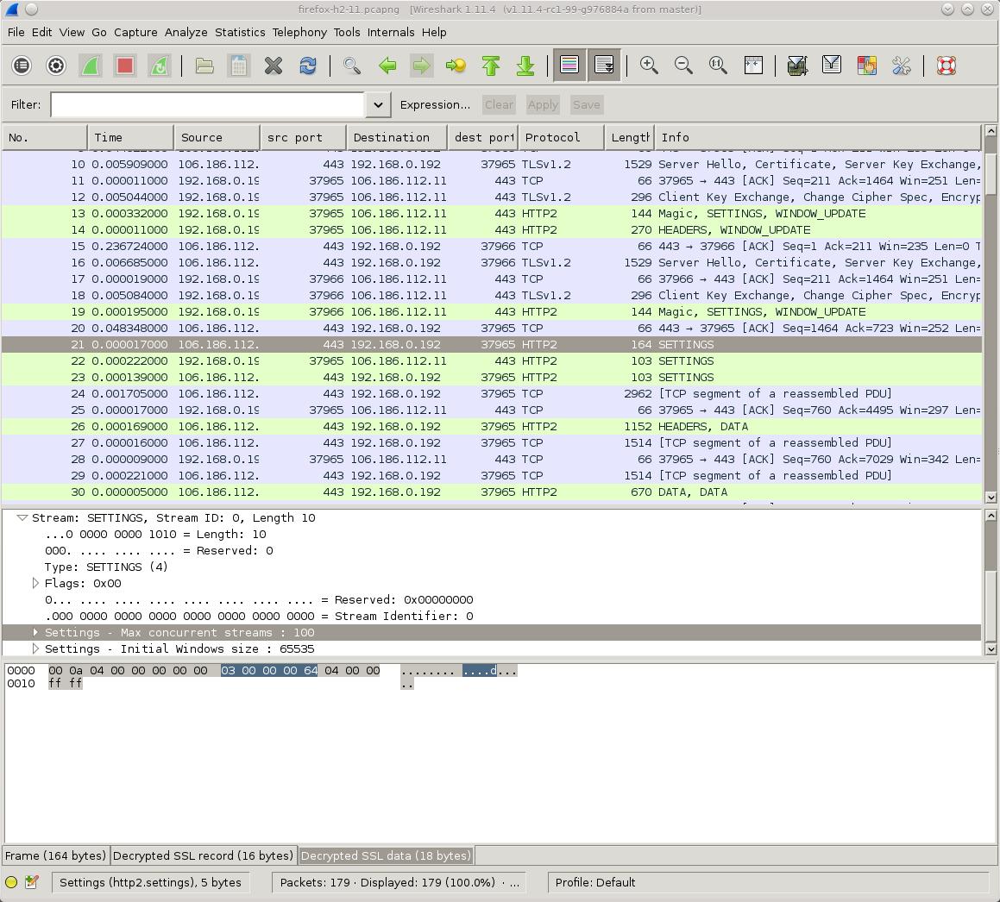
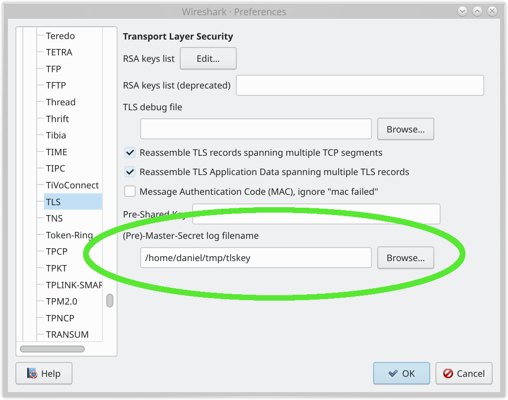

# SSLKEYLOGFILE

Since a long time back, the venerable network analyzer tool Wireshark (screenshot above) has provided a way to decrypt and inspect TLS traffic when sent and received by Firefox and Chrome.

This is similarly possible to do with curl.

You do this by making the browser or curl tell Wireshark the encryption secrets so that it can decrypt them:

1. set the environment variable named `SSLKEYLOGFILE` to a filename of your choice before you start the browser or curl
2. Setting the same filename path in the Master-secret field in Wireshark. Go to Preferences->Protocols->TLS and edit the path as shown in the screenshot below.

Having done this simple operation, you can now inspect curl's or your browser's HTTPS traffic in Wireshark. Just super handy and awesome.

Just remember that if you record TLS traffic and want to save it for analyzing later, you need to also save the file with the secrets so that you can decrypt that traffic capture at a later time as well.

## libcurl-using applications too

Support for `SSLKEYLOGFILE` is provided by libcurl itself - making it possible for you to trace and inspect the TLS network data for any application built to use libcurl - not just the curl command line tool.

## Restrictions

The support for `SSLKEYLOGFILE` requires that curl was built with a TLS
backend that supports this feature. The backends that support SSLKEYLOGFILE
are: OpenSSL, libressl, BoringSSL, GnuTLS and wolfSSL.

If curl was built to use another backend, you cannot record your curl TLS traffic this way.
